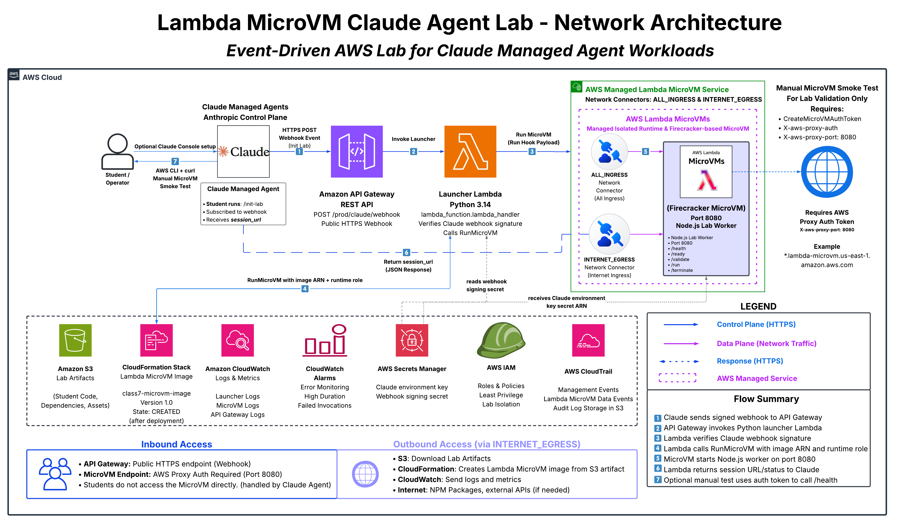
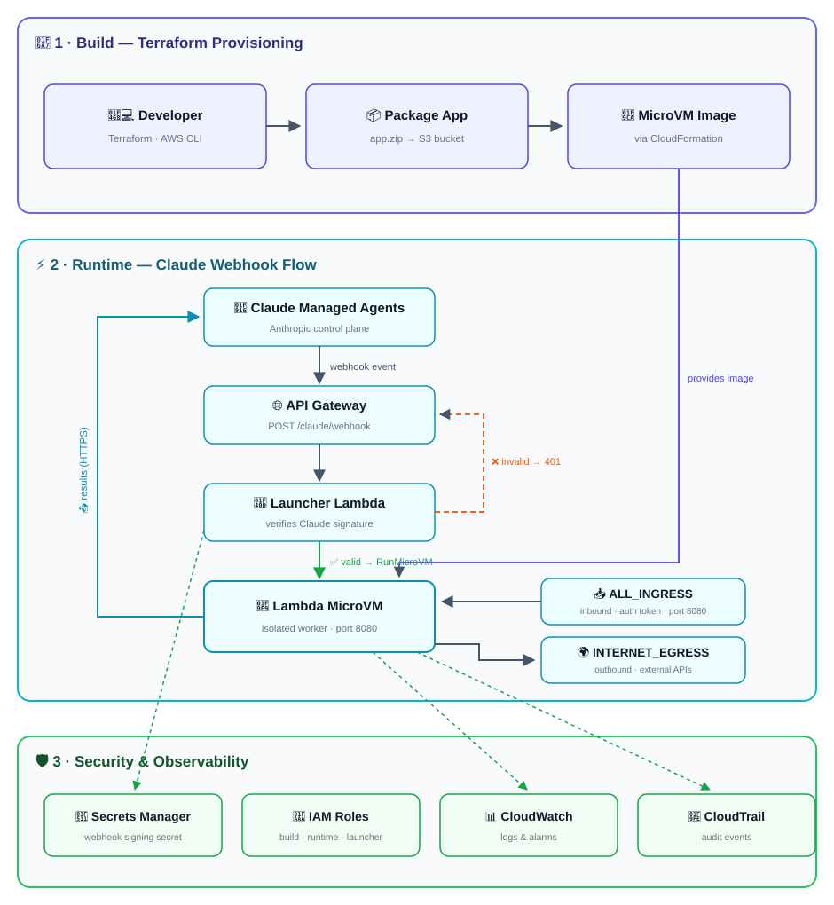

# 🚀 **Lambda MicroVM + Claude Managed Agents Lab**


---

## 📌 **Current Lab Status**

This repository is a **student lab / proof-of-concept** that demonstrates a secure AWS pattern for launching Claude Managed Agent work inside isolated Lambda MicroVM sessions. It is not claiming to be a fully production-ready enterprise platform.

Deployment values. `<ACCOUNT_ID>`, `<API_ID>`, `<SUFFIX>` and `<RANDOM_HEX>` differ per account or per deploy; get the real ones from `terraform output`:

| **Item**                              | **Value**                                                                                                            |
|---------------------------------------|----------------------------------------------------------------------------------------------------------------------|
| **AWS Region**                        | `us-east-1`                                                                                                          |
| **AWS Account**                       | `<ACCOUNT_ID>`                                                                                                       |
| **Terraform backend bucket**          | `class-7-state-files`                                                                                                |
| **Terraform backend key**             | `lambda-labs/microvm.tfstate`                                                                                        |
| **API Gateway webhook URL**           | `https://<API_ID>.execute-api.us-east-1.amazonaws.com/prod/claude/webhook`                                           |
| **Artifact bucket**                   | `microvm-artifacts-bucket`                                                                                           |
| **Artifact S3 URI**                   | `s3://microvm-artifacts-bucket/microvm-artifacts/app.zip`                                                            |
| **Claude environment key secret ARN** | `arn:aws:secretsmanager:us-east-1:<ACCOUNT_ID>:secret:lambda-microvm-lab-dev/claude/environment-key-<SUFFIX>`        |
| **Claude webhook signing secret ARN** | `arn:aws:secretsmanager:us-east-1:<ACCOUNT_ID>:secret:lambda-microvm-lab-dev/claude/webhook-signing-secret-<SUFFIX>` |
| **MicroVM image name**                | `class7-microvm-image`                                                                                               |
| **MicroVM image ARN**                 | `arn:aws:lambda:us-east-1:<ACCOUNT_ID>:microvm-image:class7-microvm-image`                                           |
| **MicroVM image state**               | `CREATED`                                                                                                            |
| **Latest active image version**       | `1.0`                                                                                                                |
| **Launcher Lambda log group**         | `/aws/lambda/lambda-microvm-lab-dev-microvm-launcher`                                                                |
| **API Gateway log group**             | `/aws/apigateway/lambda-microvm-lab-dev-claude-webhook`                                                              |
| **MicroVM log group**                 | `/aws/lambda/microvms/class7-microvm-image`                                                                          |
| **CloudTrail bucket**                 | `lambda-microvm-lab-dev-cloudtrail-<RANDOM_HEX>`                                                                     |
| **CloudTrail trail ARN**              | `arn:aws:cloudtrail:us-east-1:<ACCOUNT_ID>:trail/lambda-microvm-lab-dev-microvm-trail`                               |

Latest validation evidence:

- Terraform initialized and validated successfully.
- Terraform apply completed with `46 added, 0 changed, 0 destroyed`.
- Lambda MicroVM image state is `CREATED`.
- Latest active MicroVM image version is `1.0`.
- Manual unsigned webhook test returned `401 Invalid webhook signature`.
- Manual MicroVM runtime smoke test reached `RUNNING`.
- Direct MicroVM `/health` endpoint returned `HTTP/1.1 200 OK`.

---

## 🎯 **What Is This Project?**

This project builds a Terraform-managed AWS lab environment that connects **Claude Managed Agents** to isolated **AWS Lambda MicroVM** runtime sessions.

In everyday terms, this project creates a secure “AI workroom” in AWS. When Claude needs to run a task, a webhook request goes to API Gateway, a Python Lambda launcher verifies the request, and the workload runs inside a short-lived Lambda MicroVM instead of a shared server.

### **This helps answer a real-world security question**

> How can a company let AI agents safely perform useful technical work without giving them uncontrolled access to internal systems?

---

## 🧠 **Recruiter-Friendly Summary**

Built a Terraform-managed AWS student lab that securely connects Claude Managed Agents to isolated Lambda MicroVM runtime environments. The project uses API Gateway, Lambda, IAM, Secrets Manager, S3, CloudWatch, and CloudTrail to package, launch, monitor, and audit AI workload sessions in AWS.

### **Real-world example**

A company may want an AI assistant to review support tickets, inspect logs, or troubleshoot cloud alerts. Instead of allowing the AI to run directly on a long-lived shared server, this project launches a temporary isolated MicroVM session with controlled IAM permissions, secrets access, logging, and audit trails.

---

## 🏗️ **Architecture Stages**

### **1️⃣ Build Pipeline**

```text
Terraform apply
→ Package app/Dockerfile + app/app.js
→ Create app.zip
→ Upload app.zip to S3
→ CloudFormation creates AWS::Lambda::MicrovmImage
→ Lambda MicroVM image becomes versioned and launchable
```

### **2️⃣ Runtime Request Flow**

```text
Claude Managed Agent
→ Sends session.status_run_started webhook
→ API Gateway REST API receives POST /claude/webhook
→ Python launcher Lambda verifies webhook signature
→ Launcher Lambda calls RunMicroVM
→ Lambda MicroVM starts one isolated session
→ MicroVM worker runs the student lab Node.js service
→ Results/status flow back over HTTPS
```

### **3️⃣ Supporting AWS Services**

```text
S3              Stores the packaged MicroVM app artifact.
Secrets Manager Stores Claude environment key and webhook signing secret.
IAM             Provides least-privilege roles and policies.
CloudWatch      Stores logs, metrics, and alarms.
CloudTrail      Audits management events and Lambda MicroVM data events.
API Gateway     Exposes the Claude webhook route.
Lambda          Runs the Python launcher.
```

---

## 🖼️ **Network Architecture Diagram**



*Alternate infographic version:*



The diagrams show the lab in three stages:

1. **Build Pipeline** — Terraform packages the app (`app.zip`) to the S3 artifact
   bucket, then CloudFormation (`AWS::Lambda::MicrovmImage`) produces the Lambda
   MicroVM image.
2. **Runtime Request Flow** — Claude webhook traffic enters through API Gateway to
   the Python launcher Lambda, which verifies the signature and calls `RunMicroVM`
   to start the isolated MicroVM worker on port `8080` (`ALL_INGRESS` /
   `INTERNET_EGRESS` network connectors). Results return to Claude over HTTPS.
3. **Supporting AWS Services** — IAM, Secrets Manager, CloudWatch, and CloudTrail
   provide security, logging, and audit.

---

## ✅ **What This Lab Builds**

- S3 artifact bucket for the MicroVM application package.
- S3 object for `microvm-artifacts/app.zip`.
- Lambda MicroVM image using CloudFormation `AWS::Lambda::MicrovmImage`.
- Python launcher Lambda for Claude webhook events.
- API Gateway REST API endpoint at `/prod/claude/webhook`.
- Secrets Manager secret containers for the Claude environment key and webhook signing secret.
- Least-privilege IAM roles for MicroVM build, MicroVM runtime, launcher Lambda, and API Gateway CloudWatch logging.
- CloudWatch log groups, metric filters, and alarms.
- CloudTrail trail with management events and Lambda MicroVM data events.
- JavaScript MicroVM worker stub for student-lab validation.

---

## 🧰 **Required Tools**

| **Tool**                       | **Requirement**                      | **Purpose**                                                   |
|--------------------------------|-------------------------------------:|---------------------------------------------------------------|
| **Terraform 1.14+**            | Required                             | Deploy AWS infrastructure.                                    |
| **AWS CLI v2**                 | Required                             | Run validation, logs, MicroVM commands, and secrets updates.  |
| **Python 3.14**                | Required for this lab                | Package the launcher Lambda dependencies.                     |
| **Git Bash**                   | Recommended on Windows               | Run the lab commands consistently.                            |
| **`jq`**                       | Recommended                          | Parse JSON outputs from AWS CLI.                              |
| **Claude Console**             | Required for full Claude integration | Create Managed Agent, self-hosted environment, and webhook.   |
| **AWS Console**                | Optional                             | Capture screenshots and visually inspect resources.           |
| **VS Code**                    | Required                             | Edit Terraform, Python, JavaScript, and Markdown files.       |
| **.venv-lambda-build**         | Recommended                          | Python virtual environment for packaging the launcher Lambda. |

---

## 📁 **Project Structure**

```text
microvm/
├── app/
│   ├── app.js
│   └── Dockerfile
├── docs/
│   ├── architecture/
│   │   ├── lambda_microvm_architecture_infographic.png
│   │   └── microvm-lab-flowchart.svg
│   └── runbooks/
│       ├── CLI_COMMANDS.md
│       └── RUNBOOK.md
├── images/
│   ├── aws-verifications.jpg
│   ├── base-image-versions.jpg
│   ├── claude-console-agent-environment.jpg
│   ├── claude-console-environment.jpg
│   ├── claude-console-webhook-subscribe.jpg
│   ├── claude-console-webhook.jpg
│   ├── claude-secrets-describe-pt1.jpg
│   ├── claude-secrets-describe-pt2.jpg
│   ├── claude-secrets.jpg
│   ├── cloudtrail-selectors.jpg
│   ├── cloudwatch-alarms-pt1.jpg
│   ├── cloudwatch-alarms-pt2.jpg
│   ├── launcher-lambda-logs.jpg
│   ├── manual-microvm-health.jpg
│   ├── manual-microvm-id.jpg
│   ├── manual-microvm-launch.jpg
│   ├── manual-microvm-outputs.jpg
│   ├── manual-microvm-running.jpg
│   ├── s3-bucket-verification.jpg
│   ├── terraform-apply.jpg
│   ├── terraform-destroy.jpg
│   ├── terraform-init-fmt-validate.jpg
│   ├── terraform-outputs.jpg
│   ├── terraform-plan.jpg
│   └── webhook-smoke-test.jpg
├── launcher/
│   ├── lambda_function.py
│   └── requirements.txt
├── scripts/
│   ├── build_launcher_package.py
│   └── prepare_build_dirs.py
├── terraform/
│   ├── 1-authentication.tf
│   ├── 2-provider.tf
│   ├── 3-variables.tf
│   ├── 4-locals.tf
│   ├── 5-random.tf
│   ├── 6-s3.tf
│   ├── 7-cloudwatch.tf
│   ├── 8-iam.tf
│   ├── 9-microvm-image.tf
│   ├── 10-secrets.tf
│   ├── 11-api-gateway.tf
│   ├── 12-lambda.tf
│   ├── 13-cloudtrail.tf
│   ├── 14-outputs.tf
│   ├── terraform.tfvars
│   └── terraform.tfvars.example
├── .gitignore
└── README.md
```

---

## ⚠️ **Git Hygiene**

Do not commit generated or local-only files:

```text
build/
terraform/.terraform/
*.tfstate
*.tfstate.*
*.tfplan
terraform.tfvars
lambda-response.json
microvm-run.json
microvm-token.json
*.zip
```

Commit `terraform/terraform.tfvars.example`, but do not commit real Claude secrets.

---

## 🚀 **Deployment Steps**

> For more detailed instructions, see [**RUNBOOK**](/docs/runbooks/RUNBOOK.md).

### **1️⃣ Set shell environment**

```bash
export AWS_REGION="us-east-1"
export AWS_PROFILE="default"
```

### **2️⃣ Validate AWS identity**

```bash
aws sts get-caller-identity --region "$AWS_REGION"
```

### **3️⃣ Confirm backend bucket**

```bash
aws s3api head-bucket \
  --bucket class-7-state-files \
  --region "$AWS_REGION"
```

### **4️⃣ Check MicroVM base image versions**

```bash
aws lambda-microvms list-managed-microvm-image-versions \
  --image-identifier arn:aws:lambda:us-east-1:aws:microvm-image:al2023-1 \
  --region "$AWS_REGION" \
  --output table
```

This lab currently uses:

```hcl
microvm_base_image_version = "1"
```

### **5️⃣ Initialize, format, validate, plan and deploy**

```bash
cd terraform
terraform init -upgrade
terraform fmt -recursive
terraform validate
terraform plan
terraform apply
```

Expected latest successful result:

```text
Apply complete! Resources: 46 added, 0 changed, 0 destroyed.
```

---

## 🔑 **Configure Claude Secrets**

Do not place real Claude secret values directly inside `terraform.tfvars`.

Secret containers (the 6-character suffix is random on every deploy):

```text
Claude environment key secret:
arn:aws:secretsmanager:us-east-1:<ACCOUNT_ID>:secret:lambda-microvm-lab-dev/claude/environment-key-<SUFFIX>

Claude webhook signing secret:
arn:aws:secretsmanager:us-east-1:<ACCOUNT_ID>:secret:lambda-microvm-lab-dev/claude/webhook-signing-secret-<SUFFIX>
```

Store the Claude environment key:

```bash
aws secretsmanager put-secret-value \
  --secret-id "$CLAUDE_ENVIRONMENT_SECRET_ARN" \
  --secret-string "REPLACE_WITH_CLAUDE_ENVIRONMENT_KEY" \
  --region "$AWS_REGION"
```

Store the Claude webhook signing secret:

```bash
aws secretsmanager put-secret-value \
  --secret-id "$CLAUDE_WEBHOOK_SIGNING_SECRET_ARN" \
  --secret-string "REPLACE_WITH_CLAUDE_WEBHOOK_SIGNING_SECRET" \
  --region "$AWS_REGION"
```

---

## 🤖 **Configure Claude Console**

1. Open Claude Console.
2. Open the Claude Managed Agent.
3. Open or create the self-hosted environment.
4. Copy the environment ID and set `anthropic_environment_id` in `terraform.tfvars`.
5. Register the current Terraform output webhook URL:

    ```text
    https://<API_ID>.execute-api.us-east-1.amazonaws.com/prod/claude/webhook
    ```

6. Subscribe the webhook to:

    ```text
    session.status_run_started
    ```

7. Copy the webhook signing secret from Claude Console and store it in AWS Secrets Manager.

---

## ✅ **Validation Path 1: Webhook Security Smoke Test**

```bash
WEBHOOK_URL="$(terraform output -raw claude_webhook_url | tr -d '\r')"

curl --ssl-no-revoke -i -X POST "$WEBHOOK_URL" \
  -H "Content-Type: application/json" \
  --data-raw '{"type":"session.status_run_started","session_id":"manual-test"}'
```

Expected result:

```http
HTTP/1.1 401 Unauthorized
```

Expected body:

```json
{"error": "Invalid webhook signature"}
```

This is a passing result because manual curl requests are not signed by Claude.

---

## ✅ **Validation Path 2: Manual MicroVM Runtime Smoke Test**

```bash
MICROVM_IMAGE_ARN="$(terraform output -raw microvm_image_arn | tr -d '\r')"
MICROVM_RUNTIME_ROLE_ARN="$(terraform output -raw microvm_runtime_role_arn | tr -d '\r')"

aws lambda-microvms run-microvm \
  --image-identifier "$MICROVM_IMAGE_ARN" \
  --image-version "1.0" \
  --execution-role-arn "$MICROVM_RUNTIME_ROLE_ARN" \
  --ingress-network-connectors "arn:aws:lambda:${AWS_REGION}:aws:network-connector:aws-network-connector:ALL_INGRESS" \
  --egress-network-connectors "arn:aws:lambda:${AWS_REGION}:aws:network-connector:aws-network-connector:INTERNET_EGRESS" \
  --idle-policy '{"maxIdleDurationSeconds":900,"suspendedDurationSeconds":0,"autoResumeEnabled":false}' \
  --maximum-duration-in-seconds 28800 \
  --run-hook-payload '{"source":"manual-lab-test","session_id":"manual-test"}' \
  --region "$AWS_REGION" \
  > microvm-run.json

MICROVM_ID="$(cat microvm-run.json | jq -r '.microvmId')"
MICROVM_ENDPOINT="$(cat microvm-run.json | jq -r '.endpoint')"
```

Wait for `RUNNING`:

```bash
while true; do
  STATE="$(aws lambda-microvms get-microvm \
    --microvm-identifier "$MICROVM_ID" \
    --region "$AWS_REGION" \
    --query 'state' \
    --output text)"

  echo "MicroVM state: $STATE"

  if [ "$STATE" = "RUNNING" ]; then
    break
  fi

  if [ "$STATE" = "TERMINATED" ]; then
    echo "MicroVM terminated before becoming reachable. Check MicroVM logs."
    break
  fi

  sleep 5
done
```

Create a token and test `/health`:

```bash
aws lambda-microvms create-microvm-auth-token \
  --microvm-identifier "$MICROVM_ID" \
  --expiration-in-minutes 30 \
  --allowed-ports '[{"port":8080}]' \
  --region "$AWS_REGION" \
  > microvm-token.json

$ TOKEN="$(cat microvm-token.json | jq -r '.authToken."X-aws-proxy-auth"')"

curl -i --ssl-no-revoke "https://${MICROVM_ENDPOINT}/health" \
  -H "X-aws-proxy-auth: $TOKEN" \
  -H "X-aws-proxy-port: 8080"
```

Expected response:

```http
HTTP/1.1 200 OK
Content-Type: application/json
```

```json
{"ok":true,"service":"lambda-microvm-claude-agent-lab","lab_mode":true,"message":"Student lab MicroVM worker is running."}
```

---

## ✅ **Validation Path 3: Observability and Audit Checks**

Launcher logs:

```bash
LAUNCHER_LOG_GROUP="$(terraform output -raw launcher_lambda_log_group_name | tr -d '\r')"

MSYS_NO_PATHCONV=1 aws logs tail "$LAUNCHER_LOG_GROUP" \
  --follow \
  --region "$AWS_REGION" \
  --format short
```

CloudTrail selectors:

```bash
aws cloudtrail get-event-selectors \
  --trail-name "lambda-microvm-lab-dev-microvm-trail" \
  --region "$AWS_REGION" \
  --output json
```

Expected selectors:

```text
Log management events
Log Lambda MicroVM data events
AWS::Lambda::MicrovmImage
```

---

## 📸 Screenshot Checklist

| **Screenshot**                | **What it proves**                  | **Links for Screenshots**                                          |
|-------------------------------|-------------------------------------|--------------------------------------------------------------------|
| `aws sts get-caller-identity` | Correct AWS account is active.      |[**AWS Verifications**](images/aws-verifications.jpg)               |
| `aws s3api head-bucket`       | Terraform backend bucket exists.    |[**S3 Bucket Verification**](images/s3-bucket-verification.jpg)     |
| `terraform init -upgrade`     | Backend and providers initialized.  |[**Terraform Init**](images/terraform-init-fmt-validate.jpg)        |
| `terraform plan`              | Terraform syntax is valid.          |[**Terraform Plan**](images/terraform-plan.jpg)                     |
| `terraform apply` complete    | Infrastructure was deployed.        |[**Terraform Apply**](images/terraform-apply.jpg)                   |
| `terraform output`            | Current ARNs, URLs, and log groups. |[**Terraform Outputs**](images/terraform-outputs.jpg)               |
| API Gateway `401` curl        | Webhook security check works.       |[**Webhook Smoke Test**](images/webhook-smoke-test.jpg)             |
| Manual MicroVM launch         | Runtime and handler are correct.    |[**Manual MicroVM Launch**](images/manual-microvm-launch.jpg)       |
| MicroVM state `RUNNING`       | Runtime launch succeeded.           |[**MicroVM State Running**](images/manual-microvm-running.jpg)      |
| MicroVM `/health` `200`       | Worker is reachable.                |[**MicroVM Health**](images/manual-microvm-health.jpg)              |
| Launcher Lambda logs          | Observability is working.           |[**Launcher Lambda Logs**](images/launcher-lambda-logs.jpg)         |
| CloudWatch Alarms (Part I)    | Monitoring exists.                  |[**CloudWatch Alarms (Part I)**](images/cloudwatch-alarms-pt1.jpg)  |
| CloudWatch Alarms (Part II)   | Monitoring exists.                  |[**CloudWatch Alarms (Part II)**](images/cloudwatch-alarms-pt2.jpg) |
| CloudTrail selectors          | Audit logging is configured.        |[**CloudTrail Selectors**](images/cloudtrail-selectors.jpg)         |

---

## 🧹 **Teardown**

Terminate active MicroVMs:

```bash
aws lambda-microvms list-microvms \
  --image-identifier "$MICROVM_IMAGE_ARN" \
  --region "$AWS_REGION" \
  --output table
```

```bash
aws lambda-microvms terminate-microvm \
  --microvm-identifier REPLACE_WITH_MICROVM_ID \
  --region "$AWS_REGION"
```

Destroy Terraform resources:

```bash
terraform destroy
```

---

## 🧰 **Troubleshooting**

### **`Invalid endpoint: https://lambda..amazonaws.com` or `https://logs..amazonaws.com`**

Cause: `AWS_REGION` is empty.

Fix:

```bash
export AWS_REGION="us-east-1"
```

### **Git Bash path conversion breaks `/aws/lambda/...` log group names**

Use:

```bash
MSYS_NO_PATHCONV=1 aws logs tail "/aws/lambda/lambda-microvm-lab-dev-microvm-launcher" \
  --since 30m \
  --region "$AWS_REGION" \
  --format short
```

### **Python error: `No module named 'pydantic_core._pydantic_core'`**

Cause: Python dependencies were built for Windows instead of Lambda Linux.

Fix:

```bash
rm -rf ../build

terraform apply \
  -replace=terraform_data.launcher_package
```

### **Manual webhook test returns `401 Invalid webhook signature`**

This is expected for unsigned curl tests and means the route is secure.

### **`MICROVM_ID` is empty**

Fix:

```bash
cat microvm-run.json
MICROVM_ID="$(cat microvm-run.json | jq -r '.microvmId')"
MICROVM_ENDPOINT="$(cat microvm-run.json | jq -r '.endpoint')"
```

### **MicroVM endpoint returns `502`**

Check state:

```bash
aws lambda-microvms get-microvm \
  --microvm-identifier "$MICROVM_ID" \
  --region "$AWS_REGION" \
  --output table
```

If state is `TERMINATED`, launch a fresh MicroVM and generate a fresh token. If state is `RUNNING`, check the MicroVM logs.

### **Curl Schannel revocation error on Windows**

Fix:

```bash
curl --ssl-no-revoke ...
```

---

## 📚 **References**

- [**AWS Lambda MicroVMs**](https://docs.aws.amazon.com/lambda/latest/dg/microvms-getting-started.html)
- [**Launching Lambda MicroVMs**](https://docs.aws.amazon.com/lambda/latest/dg/microvms-launching.html)
- [**Monitoring Lambda MicroVMs**](https://docs.aws.amazon.com/lambda/latest/dg/microvms-monitoring.html)
- [**CloudFormation `AWS::Lambda::MicrovmImage`**](https://docs.aws.amazon.com/AWSCloudFormation/latest/TemplateReference/aws-resource-lambda-microvmimage.html)
- [**Terraform S3 backend**](https://developer.hashicorp.com/terraform/language/backend/s3)
- [**Terraform AWS provider**](https://registry.terraform.io/providers/hashicorp/aws/latest/docs)
- [**Claude Self-Hosted Sandboxes on AWS Lambda MicroVMs (GitHub)**](https://github.com/aws-samples/sample-lambda-microvm-claude-managed-agents)

---

## 👥 **Author**

| **Role**                    | **Name / Group**                           |
| --------------------------- | ------------------------------------------ |
| **Project Author**          | `T.I.Q.S.`                                 |
| **Project Team**            | `The Brotherhood of jerMutants — Wolfpack` |
| **Team Lead**               | `John Sweeney`                             |
| **Course Instructor**       | `Theo WAF`                                 |
| **Project Version**         | `v2.1`                                     |
| **Completion Date**         | `July 2026`                                |
| **Project Type**            | `Student lab / proof-of-concept`           |

---
